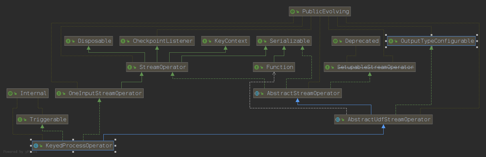

<h2>CONTENTS</h2>

[StreamExecutionEnvironment](#StreamExecutionEnvironment)

[Source](#Source)

[source from Text file](#source-from-text-file)

[source from Mysql](#source-from-mysql)

[source from Kafka](#source-from-kafka)

[Function](#Function)

[Operator](#Operator)

[Sink](#Sink)


-----

<h2 id="Knowledge">Knowledge</h2>

### java.util.ServiceLoader

### java.util.stream.Stream 

### java.util.concurrent.CompletableFuture

### java.lang.ClassLoader (used by org.apache.flink.core.execution.JobClient)

-----


<h2 id="StreamExecutionEnvironment">StreamExecutionEnvironment</h2>
ContentExDetect -> org.apache.flink.streaming.api.environment.StreamExecutionEnvironment

***org.apache.flink.streaming.api.environment.StreamExecutionEnvironment***

```
/**
 * The StreamExecutionEnvironment is the context in which a streaming program is executed. A
 * {@link LocalStreamEnvironment} will cause execution in the current JVM, a
 * {@link RemoteStreamEnvironment} will cause execution on a remote setup.
 *
 * <p>The environment provides methods to control the job execution (such as setting the parallelism
 * or the fault tolerance/checkpointing parameters) and to interact with the outside world (data access).
 *
 * @see org.apache.flink.streaming.api.environment.LocalStreamEnvironment
 * @see org.apache.flink.streaming.api.environment.RemoteStreamEnvironment
 */
@Public
public class StreamExecutionEnvironment {

	/** The default name to use for a streaming job if no other name has been specified. */
	public static final String DEFAULT_JOB_NAME = "Flink Streaming Job";

	/** The time characteristic that is used if none other is set. */
	private static final TimeCharacteristic DEFAULT_TIME_CHARACTERISTIC = TimeCharacteristic.ProcessingTime;

	/** The default buffer timeout (max delay of records in the network stack). */
	private static final long DEFAULT_NETWORK_BUFFER_TIMEOUT = 100L;

	/**
	 * The environment of the context (local by default, cluster if invoked through command line).
	 */
	private static StreamExecutionEnvironmentFactory contextEnvironmentFactory = null;

	/** The ThreadLocal used to store {@link StreamExecutionEnvironmentFactory}. */
	private static final ThreadLocal<StreamExecutionEnvironmentFactory> threadLocalContextEnvironmentFactory = new ThreadLocal<>();

	/** The default parallelism used when creating a local environment. */
	private static int defaultLocalParallelism = Runtime.getRuntime().availableProcessors();

	// ------------------------------------------------------------------------

	/** The execution configuration for this environment. */
	private final ExecutionConfig config = new ExecutionConfig();

	/** Settings that control the checkpointing behavior. */
	private final CheckpointConfig checkpointCfg = new CheckpointConfig();

	protected final List<Transformation<?>> transformations = new ArrayList<>();

	private long bufferTimeout = DEFAULT_NETWORK_BUFFER_TIMEOUT;

	protected boolean isChainingEnabled = true;

	/** The state backend used for storing k/v state and state snapshots. */
	private StateBackend defaultStateBackend;

	/** The time characteristic used by the data streams. */
	private TimeCharacteristic timeCharacteristic = DEFAULT_TIME_CHARACTERISTIC;

	protected final List<Tuple2<String, DistributedCache.DistributedCacheEntry>> cacheFile = new ArrayList<>();

	private final PipelineExecutorServiceLoader executorServiceLoader;

	private final Configuration configuration;

	private final ClassLoader userClassloader;

	private final List<JobListener> jobListeners = new ArrayList<>();

	// --------------------------------------------------------------------------------------------
	// Constructor and Properties
	// --------------------------------------------------------------------------------------------

	public StreamExecutionEnvironment() {
		this(new Configuration());
		// unfortunately, StreamExecutionEnvironment always (implicitly) had a public constructor.
		// This constructor is not useful because the execution environment cannot be used for
		// execution. We're keeping this to appease the binary compatibiliy checks.
	}

	/**
	 * Creates a new {@link StreamExecutionEnvironment} that will use the given {@link
	 * Configuration} to configure the {@link PipelineExecutor}.
	 */
	@PublicEvolving
	public StreamExecutionEnvironment(final Configuration configuration) {
		this(DefaultExecutorServiceLoader.INSTANCE, configuration, null);
	}

	/**
	 * Creates a new {@link StreamExecutionEnvironment} that will use the given {@link
	 * Configuration} to configure the {@link PipelineExecutor}.
	 *
	 * <p>In addition, this constructor allows specifying the {@link PipelineExecutorServiceLoader} and
	 * user code {@link ClassLoader}.
	 */
	@PublicEvolving
	public StreamExecutionEnvironment(
			final PipelineExecutorServiceLoader executorServiceLoader,
			final Configuration configuration,
			final ClassLoader userClassloader) {
		this.executorServiceLoader = checkNotNull(executorServiceLoader);
		this.configuration = checkNotNull(configuration);
		this.userClassloader = userClassloader == null ? getClass().getClassLoader() : userClassloader;

		// the configuration of a job or an operator can be specified at the following places:
		//     i) at the operator level using e.g. parallelism using the SingleOutputStreamOperator.setParallelism().
		//     ii) programmatically by using e.g. the env.setRestartStrategy() method
		//     iii) in the configuration passed here
		//
		// if specified in multiple places, the priority order is the above.
		//
		// Given this, it is safe to overwrite the execution config default values here because all other ways assume
		// that the env is already instantiated so they will overwrite the value passed here.
		this.configure(this.configuration, this.userClassloader);
	}
	
......
	
	/**
	 * by james.
	 * 通过getStreamGraphGenerator()，生成StreamGraphGenerator
	 * 通过StreamGraphGenerator的generate()，生成StreamGraph
	 * StreamGraph的getJobGraph(@Nullable JobID jobID)方法调用StreamingJobGraphGenerator的createJobGraph()方法，
	 * 可以直接生成JobGraph。
	 */
	/**
	 * Getter of the {@link org.apache.flink.streaming.api.graph.StreamGraph StreamGraph} of the streaming job
	 * with the option to clear previously registered {@link Transformation transformations}. Clearing the
	 * transformations allows, for example, to not re-execute the same operations when calling
	 * {@link #execute()} multiple times.
	 *
	 * @param jobName              Desired name of the job
	 * @param clearTransformations Whether or not to clear previously registered transformations
	 * @return The streamgraph representing the transformations
	 */
	@Internal
	public StreamGraph getStreamGraph(String jobName, boolean clearTransformations) {
		StreamGraph streamGraph = getStreamGraphGenerator().setJobName(jobName).generate();
		if (clearTransformations) {
			this.transformations.clear();
		}
		return streamGraph;
	}

	/**
	 * by james
	 * 参数transformations是需要StreamExecutionEnvironment在调用该方法前传入的
	 * transformations是一个存放transformation的List
	 * transformations是通过调用addOperator()方法，添加transformation元素的，如addSource()、addSink()
	 * @return
	 */
	private StreamGraphGenerator getStreamGraphGenerator() {
		if (transformations.size() <= 0) {
			throw new IllegalStateException("No operators defined in streaming topology. Cannot execute.");
		}
		return new StreamGraphGenerator(transformations, config, checkpointCfg)
			.setStateBackend(defaultStateBackend)
			.setChaining(isChainingEnabled)
			.setUserArtifacts(cacheFile)
			.setTimeCharacteristic(timeCharacteristic)
			.setDefaultBufferTimeout(bufferTimeout);
	}
	
......

	/**
	 * by james
	 * 当addOperator()方法被调用时，会在StreamExecutionEnvironment的transformations会add对应的transformation
	 * DataStream的addSink()方法会调用DataStreamSink的getTransformation()方法
	 * 并非所有的Operator都有transformation，只有个别的Operator才有对应的transformation，如：Source, Sink, Union, Split
	 * 详细说明，见org.apache.flink.api.dag.Transformation
	 */
	/**
	 * Adds an operator to the list of operators that should be executed when calling
	 * {@link #execute}.
	 *
	 * <p>When calling {@link #execute()} only the operators that where previously added to the list
	 * are executed.
	 *
	 * <p>This is not meant to be used by users. The API methods that create operators must call
	 * this method.
	 */
	@Internal
	public void addOperator(Transformation<?> transformation) {
		Preconditions.checkNotNull(transformation, "transformation must not be null.");
		this.transformations.add(transformation);
	}	
	
......
		
	/**
	 * by james
	 * StreamGraph -> JobExecutionResult
	 */
	/**
	 * Triggers the program execution. The environment will execute all parts of
	 * the program that have resulted in a "sink" operation. Sink operations are
	 * for example printing results or forwarding them to a message queue.
	 *
	 * @param streamGraph the stream graph representing the transformations
	 * @return The result of the job execution, containing elapsed time and accumulators.
	 * @throws Exception which occurs during job execution.
	 */
	@Internal
	public JobExecutionResult execute(StreamGraph streamGraph) throws Exception {
		final JobClient jobClient = executeAsync(streamGraph);

		try {
			final JobExecutionResult jobExecutionResult;

			if (configuration.getBoolean(DeploymentOptions.ATTACHED)) {
				jobExecutionResult = jobClient.getJobExecutionResult(userClassloader).get();
			} else {
				jobExecutionResult = new DetachedJobExecutionResult(jobClient.getJobID());
			}

			jobListeners.forEach(jobListener -> jobListener.onJobExecuted(jobExecutionResult, null));

			return jobExecutionResult;
		} catch (Throwable t) {
			jobListeners.forEach(jobListener -> {
				jobListener.onJobExecuted(null, ExceptionUtils.stripExecutionException(t));
			});
			ExceptionUtils.rethrowException(t);

			// never reached, only make javac happy
			return null;
		}
	}
	
......
	
}	
```

***生成StreamGraph***

.png)

<h3 id="StreamGraphGenerator">StreamGraphGenerator</h3>

***org.apache.flink.streaming.api.graph.StreamGraphGenerator***

``` 
/**
 * A generator that generates a {@link StreamGraph} from a graph of
 * {@link Transformation}s.
 *
 * <p>This traverses the tree of {@code Transformations} starting from the sinks. At each
 * transformation we recursively transform the inputs, then create a node in the {@code StreamGraph}
 * and add edges from the input Nodes to our newly created node. The transformation methods
 * return the IDs of the nodes in the StreamGraph that represent the input transformation. Several
 * IDs can be returned to be able to deal with feedback transformations and unions.
 *
 * <p>Partitioning, split/select and union don't create actual nodes in the {@code StreamGraph}. For
 * these, we create a virtual node in the {@code StreamGraph} that holds the specific property, i.e.
 * partitioning, selector and so on. When an edge is created from a virtual node to a downstream
 * node the {@code StreamGraph} resolved the id of the original node and creates an edge
 * in the graph with the desired property. For example, if you have this graph:
 *
 * <pre>
 *     Map-1 -&gt; HashPartition-2 -&gt; Map-3
 * </pre>
 *
 * <p>where the numbers represent transformation IDs. We first recurse all the way down. {@code Map-1}
 * is transformed, i.e. we create a {@code StreamNode} with ID 1. Then we transform the
 * {@code HashPartition}, for this, we create virtual node of ID 4 that holds the property
 * {@code HashPartition}. This transformation returns the ID 4. Then we transform the {@code Map-3}.
 * We add the edge {@code 4 -> 3}. The {@code StreamGraph} resolved the actual node with ID 1 and
 * creates and edge {@code 1 -> 3} with the property HashPartition.
 */
@Internal
public class StreamGraphGenerator {

	private static final Logger LOG = LoggerFactory.getLogger(StreamGraphGenerator.class);

	public static final int DEFAULT_LOWER_BOUND_MAX_PARALLELISM = KeyGroupRangeAssignment.DEFAULT_LOWER_BOUND_MAX_PARALLELISM;

	public static final ScheduleMode DEFAULT_SCHEDULE_MODE = ScheduleMode.EAGER;

	public static final TimeCharacteristic DEFAULT_TIME_CHARACTERISTIC = TimeCharacteristic.ProcessingTime;

	public static final String DEFAULT_JOB_NAME = "Flink Streaming Job";

	/** The default buffer timeout (max delay of records in the network stack). */
	public static final long DEFAULT_NETWORK_BUFFER_TIMEOUT = 100L;

	public static final String DEFAULT_SLOT_SHARING_GROUP = "default";

	private final List<Transformation<?>> transformations;

	private final ExecutionConfig executionConfig;

	private final CheckpointConfig checkpointConfig;

	private SavepointRestoreSettings savepointRestoreSettings = SavepointRestoreSettings.none();

	private StateBackend stateBackend;

	private boolean chaining = true;

	private ScheduleMode scheduleMode = DEFAULT_SCHEDULE_MODE;

	private Collection<Tuple2<String, DistributedCache.DistributedCacheEntry>> userArtifacts;

	private TimeCharacteristic timeCharacteristic = DEFAULT_TIME_CHARACTERISTIC;

	private long defaultBufferTimeout = DEFAULT_NETWORK_BUFFER_TIMEOUT;

	private String jobName = DEFAULT_JOB_NAME;
	
......

	/**
	 * byjames
	 * 被StreamExecutionEnvironment调用，生成StreamGraph
	 * 调用transform()方法，对包含的transform进行转换
	 * @return
	 */
	public StreamGraph generate() {
		streamGraph = new StreamGraph(executionConfig, checkpointConfig, savepointRestoreSettings);
		streamGraph.setStateBackend(stateBackend);
		streamGraph.setChaining(chaining);
		streamGraph.setScheduleMode(scheduleMode);
		streamGraph.setUserArtifacts(userArtifacts);
		streamGraph.setTimeCharacteristic(timeCharacteristic);
		streamGraph.setJobName(jobName);
		streamGraph.setBlockingConnectionsBetweenChains(blockingConnectionsBetweenChains);

		alreadyTransformed = new HashMap<>();

		for (Transformation<?> transformation: transformations) {
			transform(transformation);
		}

		final StreamGraph builtStreamGraph = streamGraph;

		alreadyTransformed.clear();
		alreadyTransformed = null;
		streamGraph = null;

		return builtStreamGraph;
	}
	
......
		
```

<h3 id="Transformation">Transformation</h3>

***org.apache.flink.api.dag.Transformation***

``` 
/**
 * A {@code Transformation} represents the operation that creates a
 * DataStream. Every DataStream has an underlying
 * {@code Transformation} that is the origin of said DataStream.
 *
 * <p>API operations such as DataStream#map create
 * a tree of {@code Transformation}s underneath. When the stream program is to be executed
 * this graph is translated to a StreamGraph using StreamGraphGenerator.
 *
 * <p>A {@code Transformation} does not necessarily correspond to a physical operation
 * at runtime. Some operations are only DataStreamlogical concepts. Examples of this are union,
 * split/select data stream, partitioning.
 *
 * <p>The following graph of {@code Transformations}:
 * <pre>{@code
 *   Source              Source
 *      +                   +
 *      |                   |
 *      v                   v
 *  Rebalance          HashPartition
 *      +                   +
 *      |                   |
 *      |                   |
 *      +------>Union<------+
 *                +
 *                |
 *                v
 *              Split
 *                +
 *                |
 *                v
 *              Select
 *                +
 *                v
 *               Map
 *                +
 *                |
 *                v
 *              Sink
 * }</pre>
 *
 * <p>Would result in this graph of operations at runtime:
 * <pre>{@code
 *  Source              Source
 *    +                   +
 *    |                   |
 *    |                   |
 *    +------->Map<-------+
 *              +
 *              |
 *              v
 *             Sink
 * }</pre>
 *
 * <p>The information about partitioning, union, split/select end up being encoded in the edges
 * that connect the sources to the map operation.
 *
 * @param <T> The type of the elements that result from this {@code Transformation}
 */
@Internal
public abstract class Transformation<T> {

	// Has to be equal to StreamGraphGenerator.UPPER_BOUND_MAX_PARALLELISM
	public static final int UPPER_BOUND_MAX_PARALLELISM = 1 << 15;

	public static final int DEFAULT_MANAGED_MEMORY_WEIGHT = 1;

	// This is used to assign a unique ID to every Transformation
	protected static Integer idCounter = 0;
	
......
	
```

<h3 id="StreamingJobGraphGenerator">StreamingJobGraphGenerator</h3>

***org.apache.flink.streaming.api.graph.StreamingJobGraphGenerator***

``` 
/** by james.
 * StreamGraph -> JobGraph
 */
/**
 * The StreamingJobGraphGenerator converts a {@link StreamGraph} into a {@link JobGraph}.
 */
@Internal
public class StreamingJobGraphGenerator {

	private static final Logger LOG = LoggerFactory.getLogger(StreamingJobGraphGenerator.class);

	private static final int MANAGED_MEMORY_FRACTION_SCALE = 16;

	// ------------------------------------------------------------------------

	public static JobGraph createJobGraph(StreamGraph streamGraph) {
		return createJobGraph(streamGraph, null);
	}

	public static JobGraph createJobGraph(StreamGraph streamGraph, @Nullable JobID jobID) {
		return new StreamingJobGraphGenerator(streamGraph, jobID).createJobGraph();
	}

	// ------------------------------------------------------------------------

	private final StreamGraph streamGraph;

	private final Map<Integer, JobVertex> jobVertices;
	private final JobGraph jobGraph;
	private final Collection<Integer> builtVertices;

	private final List<StreamEdge> physicalEdgesInOrder;

	private final Map<Integer, Map<Integer, StreamConfig>> chainedConfigs;

	private final Map<Integer, StreamConfig> vertexConfigs;
	private final Map<Integer, String> chainedNames;

	private final Map<Integer, ResourceSpec> chainedMinResources;
	private final Map<Integer, ResourceSpec> chainedPreferredResources;

	private final Map<Integer, InputOutputFormatContainer> chainedInputOutputFormats;

	private final StreamGraphHasher defaultStreamGraphHasher;
	private final List<StreamGraphHasher> legacyStreamGraphHashers;

......

	private JobGraph createJobGraph() {
		preValidate();

		// make sure that all vertices start immediately
		jobGraph.setScheduleMode(streamGraph.getScheduleMode());

		// Generate deterministic hashes for the nodes in order to identify them across
		// submission iff they didn't change.
		Map<Integer, byte[]> hashes = defaultStreamGraphHasher.traverseStreamGraphAndGenerateHashes(streamGraph);

		// Generate legacy version hashes for backwards compatibility
		List<Map<Integer, byte[]>> legacyHashes = new ArrayList<>(legacyStreamGraphHashers.size());
		for (StreamGraphHasher hasher : legacyStreamGraphHashers) {
			legacyHashes.add(hasher.traverseStreamGraphAndGenerateHashes(streamGraph));
		}

		Map<Integer, List<Tuple2<byte[], byte[]>>> chainedOperatorHashes = new HashMap<>();

		/**
		 * by james.
		 * 被StreamGraph的getJobGraph()方法调用
		 * StreamGraph -> JobGraph的主要工作就是setChaining()，优化Operator的计算
		 */
		setChaining(hashes, legacyHashes, chainedOperatorHashes);

		setPhysicalEdges();

		setSlotSharingAndCoLocation();

		setManagedMemoryFraction(
			Collections.unmodifiableMap(jobVertices),
			Collections.unmodifiableMap(vertexConfigs),
			Collections.unmodifiableMap(chainedConfigs),
			id -> streamGraph.getStreamNode(id).getMinResources(),
			id -> streamGraph.getStreamNode(id).getManagedMemoryWeight());

		configureCheckpointing();

		jobGraph.setSavepointRestoreSettings(streamGraph.getSavepointRestoreSettings());

		JobGraphGenerator.addUserArtifactEntries(streamGraph.getUserArtifacts(), jobGraph);

		// set the ExecutionConfig last when it has been finalized
		try {
			jobGraph.setExecutionConfig(streamGraph.getExecutionConfig());
		}
		catch (IOException e) {
			throw new IllegalConfigurationException("Could not serialize the ExecutionConfig." +
					"This indicates that non-serializable types (like custom serializers) were registered");
		}

		return jobGraph;
	}
	
......

}

```

.png)

<p>StreamGraph -> JobGraph的过程在<span style="color: #dc143c; ">org.apache.flink.client.FlinkPipelineTranslationUtil</span>中完成。</p>

```
/**
 * Utility for transforming {@link Pipeline FlinkPipelines} into a {@link JobGraph}. This uses
 * reflection or service discovery to find the right {@link FlinkPipelineTranslator} for a given
 * subclass of {@link Pipeline}.
 */
public final class FlinkPipelineTranslationUtil {

	/**
	 * Transmogrifies the given {@link Pipeline} to a {@link JobGraph}.
	 */
	public static JobGraph getJobGraph(
		Pipeline pipeline,
		Configuration optimizerConfiguration,
		int defaultParallelism) {

		FlinkPipelineTranslator pipelineTranslator = getPipelineTranslator(pipeline);

		return pipelineTranslator.translateToJobGraph(pipeline,
			optimizerConfiguration,
			defaultParallelism);
	}
	
......

}
```

<h2 id="Source">Source</h2>

<h3 id="source-from-text-file">source from text file</h3>

***org.apache.flink.streaming.api.environment.StreamExecutionEnvironment***


```
	/**
	 * Reads the given file line-by-line and creates a data stream that contains a string with the
	 * contents of each such line. The {@link java.nio.charset.Charset} with the given name will be
	 * used to read the files.
	 *
	 * <p><b>NOTES ON CHECKPOINTING: </b> The source monitors the path, creates the
	 * {@link org.apache.flink.core.fs.FileInputSplit FileInputSplits} to be processed,
	 * forwards them to the downstream {@link ContinuousFileReaderOperator readers} to read the actual data,
	 * and exits, without waiting for the readers to finish reading. This implies that no more checkpoint
	 * barriers are going to be forwarded after the source exits, thus having no checkpoints after that point.
	 *
	 * @param filePath
	 * 		The path of the file, as a URI (e.g., "file:///some/local/file" or "hdfs://host:port/file/path")
	 * @param charsetName
	 * 		The name of the character set used to read the file
	 * @return The data stream that represents the data read from the given file as text lines
	 */
	public DataStreamSource<String> readTextFile(String filePath, String charsetName) {
		Preconditions.checkArgument(!StringUtils.isNullOrWhitespaceOnly(filePath), "The file path must not be null or blank.");

		TextInputFormat format = new TextInputFormat(new Path(filePath));
		format.setFilesFilter(FilePathFilter.createDefaultFilter());
		TypeInformation<String> typeInfo = BasicTypeInfo.STRING_TYPE_INFO;
		format.setCharsetName(charsetName);

		return readFile(format, filePath, FileProcessingMode.PROCESS_ONCE, -1, typeInfo);
	}
```

```
	private <OUT> DataStreamSource<OUT> createFileInput(FileInputFormat<OUT> inputFormat,
														TypeInformation<OUT> typeInfo,
														String sourceName,
														FileProcessingMode monitoringMode,
														long interval) {

		Preconditions.checkNotNull(inputFormat, "Unspecified file input format.");
		Preconditions.checkNotNull(typeInfo, "Unspecified output type information.");
		Preconditions.checkNotNull(sourceName, "Unspecified name for the source.");
		Preconditions.checkNotNull(monitoringMode, "Unspecified monitoring mode.");

		Preconditions.checkArgument(monitoringMode.equals(FileProcessingMode.PROCESS_ONCE) ||
				interval >= ContinuousFileMonitoringFunction.MIN_MONITORING_INTERVAL,
			"The path monitoring interval cannot be less than " +
					ContinuousFileMonitoringFunction.MIN_MONITORING_INTERVAL + " ms.");

		ContinuousFileMonitoringFunction<OUT> monitoringFunction =
			new ContinuousFileMonitoringFunction<>(inputFormat, monitoringMode, getParallelism(), interval);

		ContinuousFileReaderOperator<OUT> reader =
			new ContinuousFileReaderOperator<>(inputFormat);

		SingleOutputStreamOperator<OUT> source = addSource(monitoringFunction, sourceName)
				.transform("Split Reader: " + sourceName, typeInfo, reader);

		return new DataStreamSource<>(source);
	}
```

<p><span style="color: #dc143c; ">addSource(monitoringFunction, sourceName)</span>把monitoringFunction封装成了StreamSource(<span style="color:#00008b;">StreamSource<OUT, SRC extends SourceFunction<OUT>> extends AbstractUdfStreamOperator<OUT, SRC></span>)，而StreamSource是继承自AbstractUdfStreamOperator的子类，StreamSource在new的过程中，调用了AbstractUdfStreamOperator的setup()方法，通过<span style="color: #dc143c; ">FunctionUtils.setFunctionRuntimeContext(userFunction, getRuntimeContext());</span>将RuntimeContext注入到StreamSource中。</p>

<p><span style="color: #dc143c; ">transform("Split Reader: " + sourceName, typeInfo, reader)</span>是Operator之间的转换，主要的工作是把输入转化成输出，通过<p><span style="color: #dc143c; ">SimpleOperatorFactory.of()</span>方法实现。</p>

***org.apache.flink.streaming.api.functions.source.ContinuousFileMonitoringFunction***


```
public class ContinuousFileMonitoringFunction<OUT>
	extends RichSourceFunction<TimestampedFileInputSplit> implements CheckpointedFunction {
	private static final long serialVersionUID = 1L;

	private static final Logger LOG = LoggerFactory.getLogger(ContinuousFileMonitoringFunction.class);


	/**
	 * The minimum interval allowed between consecutive path scans.
	 *
	 * <p><b>NOTE:</b> Only applicable to the {@code PROCESS_CONTINUOUSLY} mode.
	 */
	public static final long MIN_MONITORING_INTERVAL = 1L;

	/** The path to monitor. */
	private final String path;

	/** The parallelism of the downstream readers. */
	private final int readerParallelism;

	/** The {@link FileInputFormat} to be read. */
	private final FileInputFormat<OUT> format;

	/** The interval between consecutive path scans. */
	private final long interval;

	/** Which new data to process (see {@link FileProcessingMode}. */
	private final FileProcessingMode watchType;

	/** The maximum file modification time seen so far. */
	private volatile long globalModificationTime = Long.MIN_VALUE;

	private transient Object checkpointLock;

	private volatile boolean isRunning = true;

	private transient ListState<Long> checkpointedState;

    ......

	@Override
	public void run(SourceFunction.SourceContext<TimestampedFileInputSplit> context) throws Exception {
		Path p = new Path(path);
		FileSystem fileSystem = FileSystem.get(p.toUri());
		if (!fileSystem.exists(p)) {
			throw new FileNotFoundException("The provided file path " + path + " does not exist.");
		}

		checkpointLock = context.getCheckpointLock();
		switch (watchType) {
			case PROCESS_CONTINUOUSLY:
				while (isRunning) {
					synchronized (checkpointLock) {
						monitorDirAndForwardSplits(fileSystem, context);
					}
					Thread.sleep(interval);
				}

				// here we do not need to set the running to false and the
				// globalModificationTime to Long.MAX_VALUE because to arrive here,
				// either close() or cancel() have already been called, so this
				// is already done.

				break;
			case PROCESS_ONCE:
				synchronized (checkpointLock) {

					// the following check guarantees that if we restart
					// after a failure and we managed to have a successful
					// checkpoint, we will not reprocess the directory.

					if (globalModificationTime == Long.MIN_VALUE) {
						monitorDirAndForwardSplits(fileSystem, context);
						globalModificationTime = Long.MAX_VALUE;
					}
					isRunning = false;
				}
				break;
			default:
				isRunning = false;
				throw new RuntimeException("Unknown WatchType" + watchType);
		}
	}
    
    ......

	@Override
	public void initializeState(FunctionInitializationContext context) throws Exception {

		Preconditions.checkState(this.checkpointedState == null,
			"The " + getClass().getSimpleName() + " has already been initialized.");

		this.checkpointedState = context.getOperatorStateStore().getListState(
			new ListStateDescriptor<>(
				"file-monitoring-state",
				LongSerializer.INSTANCE
			)
		);

		if (context.isRestored()) {
			LOG.info("Restoring state for the {}.", getClass().getSimpleName());

			List<Long> retrievedStates = new ArrayList<>();
			for (Long entry : this.checkpointedState.get()) {
				retrievedStates.add(entry);
			}

			// given that the parallelism of the function is 1, we can only have 1 or 0 retrieved items.
			// the 0 is for the case that we are migrating from a previous Flink version.

			Preconditions.checkArgument(retrievedStates.size() <= 1,
				getClass().getSimpleName() + " retrieved invalid state.");

			if (retrievedStates.size() == 1 && globalModificationTime != Long.MIN_VALUE) {
				// this is the case where we have both legacy and new state.
				// The two should be mutually exclusive for the operator, thus we throw the exception.

				throw new IllegalArgumentException(
					"The " + getClass().getSimpleName() + " has already restored from a previous Flink version.");

			} else if (retrievedStates.size() == 1) {
				this.globalModificationTime = retrievedStates.get(0);
				if (LOG.isDebugEnabled()) {
					LOG.debug("{} retrieved a global mod time of {}.",
						getClass().getSimpleName(), globalModificationTime);
				}
			}

		} else {
			LOG.info("No state to restore for the {}.", getClass().getSimpleName());
		}
	}

    ......

	//	---------------------			Checkpointing			--------------------------

	@Override
	public void snapshotState(FunctionSnapshotContext context) throws Exception {
		Preconditions.checkState(this.checkpointedState != null,
			"The " + getClass().getSimpleName() + " state has not been properly initialized.");

		this.checkpointedState.clear();
		this.checkpointedState.add(this.globalModificationTime);

		if (LOG.isDebugEnabled()) {
			LOG.debug("{} checkpointed {}.", getClass().getSimpleName(), globalModificationTime);
		}
	}

    ......

	/**
	 * Creates the input splits to be forwarded to the downstream tasks of the
	 * {@link ContinuousFileReaderOperator}. Splits are sorted <b>by modification time</b> before
	 * being forwarded and only splits belonging to files in the {@code eligibleFiles}
	 * list will be processed.
	 * @param eligibleFiles The files to process.
	 */
	private Map<Long, List<TimestampedFileInputSplit>> getInputSplitsSortedByModTime(
				Map<Path, FileStatus> eligibleFiles) throws IOException {

		Map<Long, List<TimestampedFileInputSplit>> splitsByModTime = new TreeMap<>();
		if (eligibleFiles.isEmpty()) {
			return splitsByModTime;
		}

		for (FileInputSplit split: format.createInputSplits(readerParallelism)) {
			FileStatus fileStatus = eligibleFiles.get(split.getPath());
			if (fileStatus != null) {
				Long modTime = fileStatus.getModificationTime();
				List<TimestampedFileInputSplit> splitsToForward = splitsByModTime.get(modTime);
				if (splitsToForward == null) {
					splitsToForward = new ArrayList<>();
					splitsByModTime.put(modTime, splitsToForward);
				}
				splitsToForward.add(new TimestampedFileInputSplit(
					modTime, split.getSplitNumber(), split.getPath(),
					split.getStart(), split.getLength(), split.getHostnames()));
			}
		}
		return splitsByModTime;
	}

    ......

	/**
	 * Returns the paths of the files not yet processed.
	 * @param fileSystem The filesystem where the monitored directory resides.
	 */
	private Map<Path, FileStatus> listEligibleFiles(FileSystem fileSystem, Path path) throws IOException {

		final FileStatus[] statuses;
		try {
			statuses = fileSystem.listStatus(path);
		} catch (IOException e) {
			// we may run into an IOException if files are moved while listing their status
			// delay the check for eligible files in this case
			return Collections.emptyMap();
		}

		if (statuses == null) {
			LOG.warn("Path does not exist: {}", path);
			return Collections.emptyMap();
		} else {
			Map<Path, FileStatus> files = new HashMap<>();
			// handle the new files
			for (FileStatus status : statuses) {
				if (!status.isDir()) {
					Path filePath = status.getPath();
					long modificationTime = status.getModificationTime();
					if (!shouldIgnore(filePath, modificationTime)) {
						files.put(filePath, status);
					}
				} else if (format.getNestedFileEnumeration() && format.acceptFile(status)){
					files.putAll(listEligibleFiles(fileSystem, status.getPath()));
				}
			}
			return files;
		}
	}
}
```

***org.apache.flink.streaming.api.functions.source.ContinuousFileReaderOperator***


```
/**
 * The operator that reads the {@link TimestampedFileInputSplit splits} received from the preceding
 * {@link ContinuousFileMonitoringFunction}. Contrary to the {@link ContinuousFileMonitoringFunction}
 * which has a parallelism of 1, this operator can have DOP > 1.
 *
 * <p>As soon as a split descriptor is received, it is put in a queue, and have another
 * thread read the actual data of the split. This architecture allows the separation of the
 * reading thread from the one emitting the checkpoint barriers, thus removing any potential
 * back-pressure.
 */
@Internal
public class ContinuousFileReaderOperator<OUT> extends AbstractStreamOperator<OUT>
	implements OneInputStreamOperator<TimestampedFileInputSplit, OUT>, OutputTypeConfigurable<OUT>, BoundedOneInput {

	private static final long serialVersionUID = 1L;

	private static final Logger LOG = LoggerFactory.getLogger(ContinuousFileReaderOperator.class);

	private FileInputFormat<OUT> format;
	private TypeSerializer<OUT> serializer;

	private transient Object checkpointLock;

	private transient SplitReader<OUT> reader;
	private transient SourceFunction.SourceContext<OUT> readerContext;

	private transient ListState<TimestampedFileInputSplit> checkpointedState;
	private transient List<TimestampedFileInputSplit> restoredReaderState;

    ......

}
```

<p>ContinuousFileReaderOperator通过<span style="color: #dc143c; ">this.readerContext = StreamSourceContexts.getSourceContext()</span>生成<span style="color: #dc143c; ">SourceFunction.SourceContext</span>。</p>

***org.apache.flink.streaming.api.operators.SimpleOperatorFactory***


```
/**
 * Simple factory which just wrap existed {@link StreamOperator}.
 *
 * @param <OUT> The output type of the operator
 */
@Internal
public class SimpleOperatorFactory<OUT> implements StreamOperatorFactory<OUT> {

	private final StreamOperator<OUT> operator;

	/**
	 * Create a SimpleOperatorFactory from existed StreamOperator.
	 */
	@SuppressWarnings("unchecked")
	public static <OUT> SimpleOperatorFactory<OUT> of(StreamOperator<OUT> operator) {
		if (operator == null) {
			return null;
		} else if (operator instanceof StreamSource &&
				((StreamSource) operator).getUserFunction() instanceof InputFormatSourceFunction) {
			return new SimpleInputFormatOperatorFactory<OUT>((StreamSource) operator);
		} else if (operator instanceof StreamSink &&
			((StreamSink) operator).getUserFunction() instanceof OutputFormatSinkFunction) {
			return new SimpleOutputFormatOperatorFactory<>((StreamSink) operator);
		} else if (operator instanceof AbstractUdfStreamOperator) {
			return new SimpleUdfStreamOperatorFactory<OUT>((AbstractUdfStreamOperator) operator);
		} else {
			return new SimpleOperatorFactory<>(operator);
		}
	}

    ......
}
```

***org.apache.flink.streaming.api.operators.SimpleInputFormatOperatorFactory***


```
/**
 * Input format source operator factory which just wrap existed {@link StreamSource}.
 *
 * @param <OUT> The output type of the operator
 */
@Internal
public class SimpleInputFormatOperatorFactory<OUT> extends SimpleOperatorFactory<OUT> implements InputFormatOperatorFactory<OUT> {

	private final StreamSource<OUT, InputFormatSourceFunction<OUT>> operator;

	public SimpleInputFormatOperatorFactory(StreamSource<OUT, InputFormatSourceFunction<OUT>> operator) {
		super(operator);
		this.operator = operator;
	}

	@Override
	public InputFormat<OUT, InputSplit> getInputFormat() {
		return operator.getUserFunction().getFormat();
	}
}
```

<h3 id="source-from-mysql">source from mysql</h3>

<h3 id="source-from-kafka">FlinkKafkaConsumerBase</h3>

***org.apache.flink.streaming.connectors.kafka.FlinkKafkaConsumerBase***


```
/**
 * Base class of all Flink Kafka Consumer data sources.
 * This implements the common behavior across all Kafka versions.
 *
 * <p>The Kafka version specific behavior is defined mainly in the specific subclasses of the
 * {@link AbstractFetcher}.
 *
 * @param <T> The type of records produced by this data source
 */
@Internal
public abstract class FlinkKafkaConsumerBase<T> extends RichParallelSourceFunction<T> implements
		CheckpointListener,
		ResultTypeQueryable<T>,
		CheckpointedFunction {
		
	......
		
	/**
	 * Base constructor.
	 *
	 * @param topics fixed list of topics to subscribe to (null, if using topic pattern)
	 * @param topicPattern the topic pattern to subscribe to (null, if using fixed topics)
	 * @param deserializer The deserializer to turn raw byte messages into Java/Scala objects.
	 * @param discoveryIntervalMillis the topic / partition discovery interval, in
	 *                                milliseconds (0 if discovery is disabled).
	 */
	public FlinkKafkaConsumerBase(
			List<String> topics,
			Pattern topicPattern,
			KafkaDeserializationSchema<T> deserializer,
			long discoveryIntervalMillis,
			boolean useMetrics) {
		this.topicsDescriptor = new KafkaTopicsDescriptor(topics, topicPattern);
		this.deserializer = checkNotNull(deserializer, "valueDeserializer");

		checkArgument(
			discoveryIntervalMillis == PARTITION_DISCOVERY_DISABLED || discoveryIntervalMillis >= 0,
			"Cannot define a negative value for the topic / partition discovery interval.");
		this.discoveryIntervalMillis = discoveryIntervalMillis;

		this.useMetrics = useMetrics;
	}
	
......
	
}			
```

<h2 id="State">State</h3>

<h3 id="AppendingState">AppendingState</h3>

<h2 id="Function">Function</h2>

***org.apache.flink.api.common.functions.util.FunctionUtils***

```
/**
 * Utility class that contains helper methods to work with Flink {@link Function} class.
 */
@Internal
public final class FunctionUtils {
	public static void setFunctionRuntimeContext(Function function, RuntimeContext context){
		if (function instanceof RichFunction) {
			RichFunction richFunction = (RichFunction) function;
			richFunction.setRuntimeContext(context);
		}
	}

	public static RuntimeContext getFunctionRuntimeContext(Function function, RuntimeContext defaultContext){
		if (function instanceof RichFunction) {
			RichFunction richFunction = (RichFunction) function;
			return richFunction.getRuntimeContext();
		}
		else {
			return defaultContext;
		}
	}

    ......

}
```

<p>Function持有的RuntimeContext是通过<span style="color: #dc143c; ">AbstractUdfStreamOperator</span>的</span><span style="color: #dc143c; ">setup()</span>方法，调用<span style="color: #dc143c; ">FunctionUtils.setFunctionRuntimeContext(userFunction, getRuntimeContext());</span>，进而调用<span style="color: #dc143c; ">richFunction.setRuntimeContext(context);</span>注入的，RuntimeContext来源于持有Function的Operator。</p>

<h3 id="SourceFunction">SourceFunction</h3>

***org.apache.flink.streaming.api.functions.source.SourceFunction***

```
/*
 * Licensed to the Apache Software Foundation (ASF) under one
 * or more contributor license agreements.  See the NOTICE file
 * distributed with this work for additional information
 * regarding copyright ownership.  The ASF licenses this file
 * to you under the Apache License, Version 2.0 (the
 * "License"); you may not use this file except in compliance
 * with the License.  You may obtain a copy of the License at
 *
 *     http://www.apache.org/licenses/LICENSE-2.0
 *
 * Unless required by applicable law or agreed to in writing, software
 * distributed under the License is distributed on an "AS IS" BASIS,
 * WITHOUT WARRANTIES OR CONDITIONS OF ANY KIND, either express or implied.
 * See the License for the specific language governing permissions and
 * limitations under the License.
 */

package org.apache.flink.streaming.api.functions.source;

import org.apache.flink.annotation.Public;
import org.apache.flink.annotation.PublicEvolving;
import org.apache.flink.api.common.functions.Function;
import org.apache.flink.streaming.api.TimeCharacteristic;
import org.apache.flink.streaming.api.functions.TimestampAssigner;
import org.apache.flink.streaming.api.watermark.Watermark;

import java.io.Serializable;

/**
 * Base interface for all stream data sources in Flink. The contract of a stream source
 * is the following: When the source should start emitting elements, the {@link #run} method
 * is called with a {@link SourceContext} that can be used for emitting elements.
 * The run method can run for as long as necessary. The source must, however, react to an
 * invocation of {@link #cancel()} by breaking out of its main loop.
 *
 * <h3>CheckpointedFunction Sources</h3>
 *
 * <p>Sources that also implement the {@link org.apache.flink.streaming.api.checkpoint.CheckpointedFunction}
 * interface must ensure that state checkpointing, updating of internal state and emission of
 * elements are not done concurrently. This is achieved by using the provided checkpointing lock
 * object to protect update of state and emission of elements in a synchronized block.
 *
 * <p>This is the basic pattern one should follow when implementing a checkpointed source:
 *
 * <pre>{@code
 *  public class ExampleCountSource implements SourceFunction<Long>, CheckpointedFunction {
 *      private long count = 0L;
 *      private volatile boolean isRunning = true;
 *
 *      private transient ListState<Long> checkpointedCount;
 *
 *      public void run(SourceContext<T> ctx) {
 *          while (isRunning && count < 1000) {
 *              // this synchronized block ensures that state checkpointing,
 *              // internal state updates and emission of elements are an atomic operation
 *              synchronized (ctx.getCheckpointLock()) {
 *                  ctx.collect(count);
 *                  count++;
 *              }
 *          }
 *      }
 *
 *      public void cancel() {
 *          isRunning = false;
 *      }
 *
 *      public void initializeState(FunctionInitializationContext context) {
 *          this.checkpointedCount = context
 *              .getOperatorStateStore()
 *              .getListState(new ListStateDescriptor<>("count", Long.class));
 *
 *          if (context.isRestored()) {
 *              for (Long count : this.checkpointedCount.get()) {
 *                  this.count = count;
 *              }
 *          }
 *      }
 *
 *      public void snapshotState(FunctionSnapshotContext context) {
 *          this.checkpointedCount.clear();
 *          this.checkpointedCount.add(count);
 *      }
 * }
 * }</pre>
 *
 *
 * <h3>Timestamps and watermarks:</h3>
 * Sources may assign timestamps to elements and may manually emit watermarks.
 * However, these are only interpreted if the streaming program runs on
 * {@link TimeCharacteristic#EventTime}. On other time characteristics
 * ({@link TimeCharacteristic#IngestionTime} and {@link TimeCharacteristic#ProcessingTime}),
 * the watermarks from the source function are ignored.
 *
 * @param <T> The type of the elements produced by this source.
 *
 * @see org.apache.flink.streaming.api.TimeCharacteristic
 */
@Public
public interface SourceFunction<T> extends Function, Serializable {

	/**
	 * Starts the source. Implementations can use the {@link SourceContext} emit
	 * elements.
	 *
	 * <p>Sources that implement {@link org.apache.flink.streaming.api.checkpoint.CheckpointedFunction}
	 * must lock on the checkpoint lock (using a synchronized block) before updating internal
	 * state and emitting elements, to make both an atomic operation:
	 *
	 * <pre>{@code
	 *  public class ExampleCountSource implements SourceFunction<Long>, CheckpointedFunction {
	 *      private long count = 0L;
	 *      private volatile boolean isRunning = true;
	 *
	 *      private transient ListState<Long> checkpointedCount;
	 *
	 *      public void run(SourceContext<T> ctx) {
	 *          while (isRunning && count < 1000) {
	 *              // this synchronized block ensures that state checkpointing,
	 *              // internal state updates and emission of elements are an atomic operation
	 *              synchronized (ctx.getCheckpointLock()) {
	 *                  ctx.collect(count);
	 *                  count++;
	 *              }
	 *          }
	 *      }
	 *
	 *      public void cancel() {
	 *          isRunning = false;
	 *      }
	 *
	 *      public void initializeState(FunctionInitializationContext context) {
	 *          this.checkpointedCount = context
	 *              .getOperatorStateStore()
	 *              .getListState(new ListStateDescriptor<>("count", Long.class));
	 *
	 *          if (context.isRestored()) {
	 *              for (Long count : this.checkpointedCount.get()) {
	 *                  this.count = count;
	 *              }
	 *          }
	 *      }
	 *
	 *      public void snapshotState(FunctionSnapshotContext context) {
	 *          this.checkpointedCount.clear();
	 *          this.checkpointedCount.add(count);
	 *      }
	 * }
	 * }</pre>
	 *
	 * @param ctx The context to emit elements to and for accessing locks.
	 */
	void run(SourceContext<T> ctx) throws Exception;

	/**
	 * Cancels the source. Most sources will have a while loop inside the
	 * {@link #run(SourceContext)} method. The implementation needs to ensure that the
	 * source will break out of that loop after this method is called.
	 *
	 * <p>A typical pattern is to have an {@code "volatile boolean isRunning"} flag that is set to
	 * {@code false} in this method. That flag is checked in the loop condition.
	 *
	 * <p>When a source is canceled, the executing thread will also be interrupted
	 * (via {@link Thread#interrupt()}). The interruption happens strictly after this
	 * method has been called, so any interruption handler can rely on the fact that
	 * this method has completed. It is good practice to make any flags altered by
	 * this method "volatile", in order to guarantee the visibility of the effects of
	 * this method to any interruption handler.
	 */
	void cancel();

	// ------------------------------------------------------------------------
	//  source context
	// ------------------------------------------------------------------------

	/**
	 * Interface that source functions use to emit elements, and possibly watermarks.
	 *
	 * @param <T> The type of the elements produced by the source.
	 */
	@Public // Interface might be extended in the future with additional methods.
	interface SourceContext<T> {

		/**
		 * Emits one element from the source, without attaching a timestamp. In most cases,
		 * this is the default way of emitting elements.
		 *
		 * <p>The timestamp that the element will get assigned depends on the time characteristic of
		 * the streaming program:
		 * <ul>
		 *     <li>On {@link TimeCharacteristic#ProcessingTime}, the element has no timestamp.</li>
		 *     <li>On {@link TimeCharacteristic#IngestionTime}, the element gets the system's
		 *         current time as the timestamp.</li>
		 *     <li>On {@link TimeCharacteristic#EventTime}, the element will have no timestamp initially.
		 *         It needs to get a timestamp (via a {@link TimestampAssigner}) before any time-dependent
		 *         operation (like time windows).</li>
		 * </ul>
		 *
		 * @param element The element to emit
		 */
		void collect(T element);

		/**
		 * Emits one element from the source, and attaches the given timestamp. This method
		 * is relevant for programs using {@link TimeCharacteristic#EventTime}, where the
		 * sources assign timestamps themselves, rather than relying on a {@link TimestampAssigner}
		 * on the stream.
		 *
		 * <p>On certain time characteristics, this timestamp may be ignored or overwritten.
		 * This allows programs to switch between the different time characteristics and behaviors
		 * without changing the code of the source functions.
		 * <ul>
		 *     <li>On {@link TimeCharacteristic#ProcessingTime}, the timestamp will be ignored,
		 *         because processing time never works with element timestamps.</li>
		 *     <li>On {@link TimeCharacteristic#IngestionTime}, the timestamp is overwritten with the
		 *         system's current time, to realize proper ingestion time semantics.</li>
		 *     <li>On {@link TimeCharacteristic#EventTime}, the timestamp will be used.</li>
		 * </ul>
		 *
		 * @param element The element to emit
		 * @param timestamp The timestamp in milliseconds since the Epoch
		 */
		@PublicEvolving
		void collectWithTimestamp(T element, long timestamp);

		/**
		 * Emits the given {@link Watermark}. A Watermark of value {@code t} declares that no
		 * elements with a timestamp {@code t' <= t} will occur any more. If further such
		 * elements will be emitted, those elements are considered <i>late</i>.
		 *
		 * <p>This method is only relevant when running on {@link TimeCharacteristic#EventTime}.
		 * On {@link TimeCharacteristic#ProcessingTime},Watermarks will be ignored. On
		 * {@link TimeCharacteristic#IngestionTime}, the Watermarks will be replaced by the
		 * automatic ingestion time watermarks.
		 *
		 * @param mark The Watermark to emit
		 */
		@PublicEvolving
		void emitWatermark(Watermark mark);

		/**
		 * Marks the source to be temporarily idle. This tells the system that this source will
		 * temporarily stop emitting records and watermarks for an indefinite amount of time. This
		 * is only relevant when running on {@link TimeCharacteristic#IngestionTime} and
		 * {@link TimeCharacteristic#EventTime}, allowing downstream tasks to advance their
		 * watermarks without the need to wait for watermarks from this source while it is idle.
		 *
		 * <p>Source functions should make a best effort to call this method as soon as they
		 * acknowledge themselves to be idle. The system will consider the source to resume activity
		 * again once {@link SourceContext#collect(T)}, {@link SourceContext#collectWithTimestamp(T, long)},
		 * or {@link SourceContext#emitWatermark(Watermark)} is called to emit elements or watermarks from the source.
		 */
		@PublicEvolving
		void markAsTemporarilyIdle();

		/**
		 * Returns the checkpoint lock. Please refer to the class-level comment in
		 * {@link SourceFunction} for details about how to write a consistent checkpointed
		 * source.
		 *
		 * @return The object to use as the lock
		 */
		Object getCheckpointLock();

		/**
		 * This method is called by the system to shut down the context.
		 */
		void close();
	}
}

```

<h3 id="CheckpointedFunction">CheckpointedFunction</h3>

<h2 id="Operator">Operator</h2>

<h3 id="AbstractStreamOperator">AbstractStreamOperator</h3>

```
/**
 * Base class for all stream operators. Operators that contain a user function should extend the class
 * {@link AbstractUdfStreamOperator} instead (which is a specialized subclass of this class).
 *
 * <p>For concrete implementations, one of the following two interfaces must also be implemented, to
 * mark the operator as unary or binary:
 * {@link OneInputStreamOperator} or {@link TwoInputStreamOperator}.
 *
 * <p>Methods of {@code StreamOperator} are guaranteed not to be called concurrently. Also, if using
 * the timer service, timer callbacks are also guaranteed not to be called concurrently with
 * methods on {@code StreamOperator}.
 *
 * @param <OUT> The output type of the operator
 */
@PublicEvolving
public abstract class AbstractStreamOperator<OUT>
		implements StreamOperator<OUT>, SetupableStreamOperator<OUT>, Serializable {

    ......

	@Override
	public void setup(StreamTask<?, ?> containingTask, StreamConfig config, Output<StreamRecord<OUT>> output) {
		final Environment environment = containingTask.getEnvironment();
		this.container = containingTask;
		this.config = config;
		try {
			OperatorMetricGroup operatorMetricGroup = environment.getMetricGroup().getOrAddOperator(config.getOperatorID(), config.getOperatorName());
			this.output = new CountingOutput(output, operatorMetricGroup.getIOMetricGroup().getNumRecordsOutCounter());
			if (config.isChainStart()) {
				operatorMetricGroup.getIOMetricGroup().reuseInputMetricsForTask();
			}
			if (config.isChainEnd()) {
				operatorMetricGroup.getIOMetricGroup().reuseOutputMetricsForTask();
			}
			this.metrics = operatorMetricGroup;
		} catch (Exception e) {
			LOG.warn("An error occurred while instantiating task metrics.", e);
			this.metrics = UnregisteredMetricGroups.createUnregisteredOperatorMetricGroup();
			this.output = output;
		}

		try {
			Configuration taskManagerConfig = environment.getTaskManagerInfo().getConfiguration();
			int historySize = taskManagerConfig.getInteger(MetricOptions.LATENCY_HISTORY_SIZE);
			if (historySize <= 0) {
				LOG.warn("{} has been set to a value equal or below 0: {}. Using default.", MetricOptions.LATENCY_HISTORY_SIZE, historySize);
				historySize = MetricOptions.LATENCY_HISTORY_SIZE.defaultValue();
			}

			final String configuredGranularity = taskManagerConfig.getString(MetricOptions.LATENCY_SOURCE_GRANULARITY);
			LatencyStats.Granularity granularity;
			try {
				granularity = LatencyStats.Granularity.valueOf(configuredGranularity.toUpperCase(Locale.ROOT));
			} catch (IllegalArgumentException iae) {
				granularity = LatencyStats.Granularity.OPERATOR;
				LOG.warn(
					"Configured value {} option for {} is invalid. Defaulting to {}.",
					configuredGranularity,
					MetricOptions.LATENCY_SOURCE_GRANULARITY.key(),
					granularity);
			}
			TaskManagerJobMetricGroup jobMetricGroup = this.metrics.parent().parent();
			this.latencyStats = new LatencyStats(jobMetricGroup.addGroup("latency"),
				historySize,
				container.getIndexInSubtaskGroup(),
				getOperatorID(),
				granularity);
		} catch (Exception e) {
			LOG.warn("An error occurred while instantiating latency metrics.", e);
			this.latencyStats = new LatencyStats(
				UnregisteredMetricGroups.createUnregisteredTaskManagerJobMetricGroup().addGroup("latency"),
				1,
				0,
				new OperatorID(),
				LatencyStats.Granularity.SINGLE);
		}

		this.runtimeContext = new StreamingRuntimeContext(this, environment, container.getAccumulatorMap());

		stateKeySelector1 = config.getStatePartitioner(0, getUserCodeClassloader());
		stateKeySelector2 = config.getStatePartitioner(1, getUserCodeClassloader());
	}
    ......
}
```

<p>Operator通过<span style="color: #dc143c;">this.runtimeContext = new StreamingRuntimeContext(this, environment, container.getAccumulatorMap());</span> 生成<span style="color: #dc143c; ">RuntimeContext</span>，持有<span style="color: #dc143c; ">KeyContext</span></p>

<h3 id="ProcessOperator">ProcessOperator</h3>

***org.apache.flink.streaming.api.operators.ProcessOperator***


<h3 id="KeyedProcessOperator">KeyedProcessOperator</h3>

***org.apache.flink.streaming.api.operators.KeyedProcessOperator***



<h2 id="RuntimeContext">RuntimeContext</h2>

<h3 id="RuntimeContext">RuntimeContext</h3>

***org.apache.flink.api.common.functions.RuntimeContext***

```
/**
 * A RuntimeContext contains information about the context in which functions are executed. Each parallel instance
 * of the function will have a context through which it can access static contextual information (such as
 * the current parallelism) and other constructs like accumulators and broadcast variables.
 *
 * <p>A function can, during runtime, obtain the RuntimeContext via a call to
 * {@link AbstractRichFunction#getRuntimeContext()}.
 */
@Public
public interface RuntimeContext {

	/**
	 * Returns the name of the task in which the UDF runs, as assigned during plan construction.
	 *
	 * @return The name of the task in which the UDF runs.
	 */
	String getTaskName();

	/**
	 * Returns the metric group for this parallel subtask.
	 *
	 * @return The metric group for this parallel subtask.
	 */
	@PublicEvolving
	MetricGroup getMetricGroup();

	/**
	 * Gets the parallelism with which the parallel task runs.
	 *
	 * @return The parallelism with which the parallel task runs.
	 */
	int getNumberOfParallelSubtasks();

	/**
	 * Gets the number of max-parallelism with which the parallel task runs.
	 *
	 * @return The max-parallelism with which the parallel task runs.
	 */
	@PublicEvolving
	int getMaxNumberOfParallelSubtasks();

	/**
	 * Gets the number of this parallel subtask. The numbering starts from 0 and goes up to
	 * parallelism-1 (parallelism as returned by {@link #getNumberOfParallelSubtasks()}).
	 *
	 * @return The index of the parallel subtask.
	 */
	int getIndexOfThisSubtask();

	/**
	 * Gets the attempt number of this parallel subtask. First attempt is numbered 0.
	 *
	 * @return Attempt number of the subtask.
	 */
	int getAttemptNumber();

	/**
	 * Returns the name of the task, appended with the subtask indicator, such as "MyTask (3/6)",
	 * where 3 would be ({@link #getIndexOfThisSubtask()} + 1), and 6 would be
	 * {@link #getNumberOfParallelSubtasks()}.
	 *
	 * @return The name of the task, with subtask indicator.
	 */
	String getTaskNameWithSubtasks();

	/**
	 * Returns the {@link org.apache.flink.api.common.ExecutionConfig} for the currently executing
	 * job.
	 */
	ExecutionConfig getExecutionConfig();

	/**
	 * Gets the ClassLoader to load classes that are not in system's classpath, but are part of the
	 * jar file of a user job.
	 *
	 * @return The ClassLoader for user code classes.
	 */
	ClassLoader getUserCodeClassLoader();

	// --------------------------------------------------------------------------------------------

	/**
	 * Add this accumulator. Throws an exception if the accumulator already exists in the same Task.
	 * Note that the Accumulator name must have an unique name across the Flink job. Otherwise you will
	 * get an error when incompatible accumulators from different Tasks are combined at the JobManager
	 * upon job completion.
	 */
	<V, A extends Serializable> void addAccumulator(String name, Accumulator<V, A> accumulator);

	/**
	 * Get an existing accumulator object. The accumulator must have been added
	 * previously in this local runtime context.
	 *
	 * Throws an exception if the accumulator does not exist or if the
	 * accumulator exists, but with different type.
	 */
	<V, A extends Serializable> Accumulator<V, A> getAccumulator(String name);

	/**
	 * Returns a map of all registered accumulators for this task.
	 * The returned map must not be modified.
	 * @deprecated Use getAccumulator(..) to obtain the value of an accumulator.
	 */
	@Deprecated
	@PublicEvolving
	Map<String, Accumulator<?, ?>> getAllAccumulators();

	/**
	 * Convenience function to create a counter object for integers.
	 */
	@PublicEvolving
	IntCounter getIntCounter(String name);

	/**
	 * Convenience function to create a counter object for longs.
	 */
	@PublicEvolving
	LongCounter getLongCounter(String name);

	/**
	 * Convenience function to create a counter object for doubles.
	 */
	@PublicEvolving
	DoubleCounter getDoubleCounter(String name);

	/**
	 * Convenience function to create a counter object for histograms.
	 */
	@PublicEvolving
	Histogram getHistogram(String name);

	// --------------------------------------------------------------------------------------------

	/**
	 * Tests for the existence of the broadcast variable identified by the
	 * given {@code name}.
	 *
	 * @param name The name under which the broadcast variable is registered;
	 * @return Whether a broadcast variable exists for the given name.
	 */
	@PublicEvolving
	boolean hasBroadcastVariable(String name);

	/**
	 * Returns the result bound to the broadcast variable identified by the
	 * given {@code name}.
	 * <p>
	 * IMPORTANT: The broadcast variable data structure is shared between the parallel
	 *            tasks on one machine. Any access that modifies its internal state needs to
	 *            be manually synchronized by the caller.
	 *
	 * @param name The name under which the broadcast variable is registered;
	 * @return The broadcast variable, materialized as a list of elements.
	 */
	<RT> List<RT> getBroadcastVariable(String name);

	/**
	 * Returns the result bound to the broadcast variable identified by the
	 * given {@code name}. The broadcast variable is returned as a shared data structure
	 * that is initialized with the given {@link BroadcastVariableInitializer}.
	 * <p>
	 * IMPORTANT: The broadcast variable data structure is shared between the parallel
	 *            tasks on one machine. Any access that modifies its internal state needs to
	 *            be manually synchronized by the caller.
	 *
	 * @param name The name under which the broadcast variable is registered;
	 * @param initializer The initializer that creates the shared data structure of the broadcast
	 *                    variable from the sequence of elements.
	 * @return The broadcast variable, materialized as a list of elements.
	 */
	<T, C> C getBroadcastVariableWithInitializer(String name, BroadcastVariableInitializer<T, C> initializer);

	/**
	 * Returns the {@link DistributedCache} to get the local temporary file copies of files otherwise not
	 * locally accessible.
	 *
	 * @return The distributed cache of the worker executing this instance.
	 */
	DistributedCache getDistributedCache();

	// ------------------------------------------------------------------------
	//  Methods for accessing state
	// ------------------------------------------------------------------------

	/**
	 * Gets a handle to the system's key/value state. The key/value state is only accessible
	 * if the function is executed on a KeyedStream. On each access, the state exposes the value
	 * for the key of the element currently processed by the function.
	 * Each function may have multiple partitioned states, addressed with different names.
	 *
	 * <p>Because the scope of each value is the key of the currently processed element,
	 * and the elements are distributed by the Flink runtime, the system can transparently
	 * scale out and redistribute the state and KeyedStream.
	 *
	 * <p>The following code example shows how to implement a continuous counter that counts
	 * how many times elements of a certain key occur, and emits an updated count for that
	 * element on each occurrence.
	 *
	 * <pre>{@code
	 * DataStream<MyType> stream = ...;
	 * KeyedStream<MyType> keyedStream = stream.keyBy("id");
	 *
	 * keyedStream.map(new RichMapFunction<MyType, Tuple2<MyType, Long>>() {
	 *
	 *     private ValueState<Long> state;
	 *
	 *     public void open(Configuration cfg) {
	 *         state = getRuntimeContext().getState(
	 *                 new ValueStateDescriptor<Long>("count", LongSerializer.INSTANCE, 0L));
	 *     }
	 *
	 *     public Tuple2<MyType, Long> map(MyType value) {
	 *         long count = state.value() + 1;
	 *         state.update(count);
	 *         return new Tuple2<>(value, count);
	 *     }
	 * });
	 * }</pre>
	 *
	 * @param stateProperties The descriptor defining the properties of the stats.
	 *
	 * @param <T> The type of value stored in the state.
	 *
	 * @return The partitioned state object.
	 *
	 * @throws UnsupportedOperationException Thrown, if no partitioned state is available for the
	 *                                       function (function is not part of a KeyedStream).
	 */
	@PublicEvolving
	<T> ValueState<T> getState(ValueStateDescriptor<T> stateProperties);

	/**
	 * Gets a handle to the system's key/value list state. This state is similar to the state
	 * accessed via {@link #getState(ValueStateDescriptor)}, but is optimized for state that
	 * holds lists. One can add elements to the list, or retrieve the list as a whole.
	 *
	 * <p>This state is only accessible if the function is executed on a KeyedStream.
	 *
	 * <pre>{@code
	 * DataStream<MyType> stream = ...;
	 * KeyedStream<MyType> keyedStream = stream.keyBy("id");
	 *
	 * keyedStream.map(new RichFlatMapFunction<MyType, List<MyType>>() {
	 *
	 *     private ListState<MyType> state;
	 *
	 *     public void open(Configuration cfg) {
	 *         state = getRuntimeContext().getListState(
	 *                 new ListStateDescriptor<>("myState", MyType.class));
	 *     }
	 *
	 *     public void flatMap(MyType value, Collector<MyType> out) {
	 *         if (value.isDivider()) {
	 *             for (MyType t : state.get()) {
	 *                 out.collect(t);
	 *             }
	 *         } else {
	 *             state.add(value);
	 *         }
	 *     }
	 * });
	 * }</pre>
	 *
	 * @param stateProperties The descriptor defining the properties of the stats.
	 *
	 * @param <T> The type of value stored in the state.
	 *
	 * @return The partitioned state object.
	 *
	 * @throws UnsupportedOperationException Thrown, if no partitioned state is available for the
	 *                                       function (function is not part os a KeyedStream).
	 */
	@PublicEvolving
	<T> ListState<T> getListState(ListStateDescriptor<T> stateProperties);

	/**
	 * Gets a handle to the system's key/value reducing state. This state is similar to the state
	 * accessed via {@link #getState(ValueStateDescriptor)}, but is optimized for state that
	 * aggregates values.
	 *
	 * <p>This state is only accessible if the function is executed on a KeyedStream.
	 *
	 * <pre>{@code
	 * DataStream<MyType> stream = ...;
	 * KeyedStream<MyType> keyedStream = stream.keyBy("id");
	 *
	 * keyedStream.map(new RichMapFunction<MyType, List<MyType>>() {
	 *
	 *     private ReducingState<Long> state;
	 *
	 *     public void open(Configuration cfg) {
	 *         state = getRuntimeContext().getReducingState(
	 *                 new ReducingStateDescriptor<>("sum", (a, b) -> a + b, Long.class));
	 *     }
	 *
	 *     public Tuple2<MyType, Long> map(MyType value) {
	 *         state.add(value.count());
	 *         return new Tuple2<>(value, state.get());
	 *     }
	 * });
	 *
	 * }</pre>
	 *
	 * @param stateProperties The descriptor defining the properties of the stats.
	 *
	 * @param <T> The type of value stored in the state.
	 *
	 * @return The partitioned state object.
	 *
	 * @throws UnsupportedOperationException Thrown, if no partitioned state is available for the
	 *                                       function (function is not part of a KeyedStream).
	 */
	@PublicEvolving
	<T> ReducingState<T> getReducingState(ReducingStateDescriptor<T> stateProperties);

	/**
	 * Gets a handle to the system's key/value aggregating state. This state is similar to the state
	 * accessed via {@link #getState(ValueStateDescriptor)}, but is optimized for state that
	 * aggregates values with different types.
	 *
	 * <p>This state is only accessible if the function is executed on a KeyedStream.
	 *
	 * <pre>{@code
	 * DataStream<MyType> stream = ...;
	 * KeyedStream<MyType> keyedStream = stream.keyBy("id");
	 * AggregateFunction<...> aggregateFunction = ...
	 *
	 * keyedStream.map(new RichMapFunction<MyType, List<MyType>>() {
	 *
	 *     private AggregatingState<MyType, Long> state;
	 *
	 *     public void open(Configuration cfg) {
	 *         state = getRuntimeContext().getAggregatingState(
	 *                 new AggregatingStateDescriptor<>("sum", aggregateFunction, Long.class));
	 *     }
	 *
	 *     public Tuple2<MyType, Long> map(MyType value) {
	 *         state.add(value);
	 *         return new Tuple2<>(value, state.get());
	 *     }
	 * });
	 *
	 * }</pre>
	 *
	 * @param stateProperties The descriptor defining the properties of the stats.
	 *
	 * @param <IN> The type of the values that are added to the state.
	 * @param <ACC> The type of the accumulator (intermediate aggregation state).
	 * @param <OUT> The type of the values that are returned from the state.
	 *
	 * @return The partitioned state object.
	 *
	 * @throws UnsupportedOperationException Thrown, if no partitioned state is available for the
	 *                                       function (function is not part of a KeyedStream).
	 */
	@PublicEvolving
	<IN, ACC, OUT> AggregatingState<IN, OUT> getAggregatingState(AggregatingStateDescriptor<IN, ACC, OUT> stateProperties);

	/**
	 * Gets a handle to the system's key/value folding state. This state is similar to the state
	 * accessed via {@link #getState(ValueStateDescriptor)}, but is optimized for state that
	 * aggregates values with different types.
	 *
	 * <p>This state is only accessible if the function is executed on a KeyedStream.
	 *
	 * <pre>{@code
	 * DataStream<MyType> stream = ...;
	 * KeyedStream<MyType> keyedStream = stream.keyBy("id");
	 *
	 * keyedStream.map(new RichMapFunction<MyType, List<MyType>>() {
	 *
	 *     private FoldingState<MyType, Long> state;
	 *
	 *     public void open(Configuration cfg) {
	 *         state = getRuntimeContext().getFoldingState(
	 *                 new FoldingStateDescriptor<>("sum", 0L, (a, b) -> a.count() + b, Long.class));
	 *     }
	 *
	 *     public Tuple2<MyType, Long> map(MyType value) {
	 *         state.add(value);
	 *         return new Tuple2<>(value, state.get());
	 *     }
	 * });
	 *
	 * }</pre>
	 *
	 * @param stateProperties The descriptor defining the properties of the stats.
	 *
	 * @param <T> Type of the values folded in the other state
	 * @param <ACC> Type of the value in the state
	 *
	 * @return The partitioned state object.
	 *
	 * @throws UnsupportedOperationException Thrown, if no partitioned state is available for the
	 *                                       function (function is not part of a KeyedStream).
	 *
	 * @deprecated will be removed in a future version in favor of {@link AggregatingState}
	 */
	@PublicEvolving
	@Deprecated
	<T, ACC> FoldingState<T, ACC> getFoldingState(FoldingStateDescriptor<T, ACC> stateProperties);

	/**
	 * Gets a handle to the system's key/value map state. This state is similar to the state
	 * accessed via {@link #getState(ValueStateDescriptor)}, but is optimized for state that
	 * is composed of user-defined key-value pairs
	 *
	 * <p>This state is only accessible if the function is executed on a KeyedStream.
	 *
	 * <pre>{@code
	 * DataStream<MyType> stream = ...;
	 * KeyedStream<MyType> keyedStream = stream.keyBy("id");
	 *
	 * keyedStream.map(new RichMapFunction<MyType, List<MyType>>() {
	 *
	 *     private MapState<MyType, Long> state;
	 *
	 *     public void open(Configuration cfg) {
	 *         state = getRuntimeContext().getMapState(
	 *                 new MapStateDescriptor<>("sum", MyType.class, Long.class));
	 *     }
	 *
	 *     public Tuple2<MyType, Long> map(MyType value) {
	 *         return new Tuple2<>(value, state.get(value));
	 *     }
	 * });
	 *
	 * }</pre>
	 *
	 * @param stateProperties The descriptor defining the properties of the stats.
	 *
	 * @param <UK> The type of the user keys stored in the state.
	 * @param <UV> The type of the user values stored in the state.
	 *
	 * @return The partitioned state object.
	 *
	 * @throws UnsupportedOperationException Thrown, if no partitioned state is available for the
	 *                                       function (function is not part of a KeyedStream).
	 */
	@PublicEvolving
	<UK, UV> MapState<UK, UV> getMapState(MapStateDescriptor<UK, UV> stateProperties);
}

```

<h3 id="AbstractRuntimeUDFContext">AbstractRuntimeUDFContext</h3>

***org.apache.flink.api.common.functions.util.AbstractRuntimeUDFContext***

```
/**
 * A standalone implementation of the {@link RuntimeContext}, created by runtime UDF operators.
 */
@Internal
public abstract class AbstractRuntimeUDFContext implements RuntimeContext {

	private final TaskInfo taskInfo;

	private final ClassLoader userCodeClassLoader;

	private final ExecutionConfig executionConfig;

	private final Map<String, Accumulator<?, ?>> accumulators;

	private final DistributedCache distributedCache;

	private final MetricGroup metrics;

	public AbstractRuntimeUDFContext(TaskInfo taskInfo,
										ClassLoader userCodeClassLoader,
										ExecutionConfig executionConfig,
										Map<String, Accumulator<?, ?>> accumulators,
										Map<String, Future<Path>> cpTasks,
										MetricGroup metrics) {
		this.taskInfo = checkNotNull(taskInfo);
		this.userCodeClassLoader = userCodeClassLoader;
		this.executionConfig = executionConfig;
		this.distributedCache = new DistributedCache(checkNotNull(cpTasks));
		this.accumulators = checkNotNull(accumulators);
		this.metrics = metrics;
	}
	
......
	
}	
```

<h3 id="StreamingRuntimeContext">StreamingRuntimeContext</h3>

***org.apache.flink.streaming.api.operators.StreamingRuntimeContext***


``` 
/**
 * Implementation of the {@link org.apache.flink.api.common.functions.RuntimeContext},
 * for streaming operators.
 */
@Internal
public class StreamingRuntimeContext extends AbstractRuntimeUDFContext {

	/** The operator to which this function belongs. */
	private final AbstractStreamOperator<?> operator;

	/** The task environment running the operator. */
	private final Environment taskEnvironment;

	private final StreamConfig streamConfig;

	private final String operatorUniqueID;

	public StreamingRuntimeContext(AbstractStreamOperator<?> operator,
									Environment env, Map<String, Accumulator<?, ?>> accumulators) {
		super(env.getTaskInfo(),
				env.getUserClassLoader(),
				operator.getExecutionConfig(),
				accumulators,
				env.getDistributedCacheEntries(),
				operator.getMetricGroup());

		this.operator = operator;
		this.taskEnvironment = env;
		this.streamConfig = new StreamConfig(env.getTaskConfiguration());
		this.operatorUniqueID = operator.getOperatorID().toString();
	}
	
......
	
}	
```

<h3 id="RuntimeUDFContext">RuntimeUDFContext</h3>

***org.apache.flink.api.common.functions.util.RuntimeUDFContext***


<h3 id="IterationRuntimeUDFContext">IterationRuntimeUDFContext</h3>

***org.apache.flink.api.common.operators.CollectionExecutor.IterationRuntimeUDFContext***


```
	private class IterationRuntimeUDFContext extends RuntimeUDFContext implements IterationRuntimeContext {

		public IterationRuntimeUDFContext(TaskInfo taskInfo, ClassLoader classloader, ExecutionConfig executionConfig,
											Map<String, Future<Path>> cpTasks, Map<String, Accumulator<?, ?>> accumulators,
											MetricGroup metrics) {
			super(taskInfo, classloader, executionConfig, cpTasks, accumulators, metrics);
		}

		@Override
		public int getSuperstepNumber() {
			return iterationSuperstep;
		}

		@SuppressWarnings("unchecked")
		@Override
		public <T extends Aggregator<?>> T getIterationAggregator(String name) {
			return (T) aggregators.get(name);
		}

		@SuppressWarnings("unchecked")
		@Override
		public <T extends Value> T getPreviousIterationAggregate(String name) {
			return (T) previousAggregates.get(name);
		}
	}
```

<h2 id="Sink-h2">Sink</h2>

<h2 id="Task-h2">Task</h2>

<h3 id="Task">Task</h3>

***org.apache.flink.runtime.taskmanager.Task***


```
/**
 * The Task represents one execution of a parallel subtask on a TaskManager.
 * A Task wraps a Flink operator (which may be a user function) and
 * runs it, providing all services necessary for example to consume input data,
 * produce its results (intermediate result partitions) and communicate
 * with the JobManager.
 *
 * <p>The Flink operators (implemented as subclasses of
 * {@link AbstractInvokable} have only data readers, writers, and certain event callbacks.
 * The task connects those to the network stack and actor messages, and tracks the state
 * of the execution and handles exceptions.
 *
 * <p>Tasks have no knowledge about how they relate to other tasks, or whether they
 * are the first attempt to execute the task, or a repeated attempt. All of that
 * is only known to the JobManager. All the task knows are its own runnable code,
 * the task's configuration, and the IDs of the intermediate results to consume and
 * produce (if any).
 *
 * <p>Each Task is run by one dedicated thread.
 */
public class Task implements Runnable, TaskSlotPayload, TaskActions, PartitionProducerStateProvider, CheckpointListener, BackPressureSampleableTask {

	/** The class logger. */
	private static final Logger LOG = LoggerFactory.getLogger(Task.class);

	/** The thread group that contains all task threads. */
	private static final ThreadGroup TASK_THREADS_GROUP = new ThreadGroup("Flink Task Threads");

	/** For atomic state updates. */
	private static final AtomicReferenceFieldUpdater<Task, ExecutionState> STATE_UPDATER =
			AtomicReferenceFieldUpdater.newUpdater(Task.class, ExecutionState.class, "executionState");

	// ------------------------------------------------------------------------
	//  Constant fields that are part of the initial Task construction
	// ------------------------------------------------------------------------

	/** The job that the task belongs to. */
	private final JobID jobId;

	/** The vertex in the JobGraph whose code the task executes. */
	private final JobVertexID vertexId;

	/** The execution attempt of the parallel subtask. */
	private final ExecutionAttemptID executionId;

	/** ID which identifies the slot in which the task is supposed to run. */
	private final AllocationID allocationId;

	/** TaskInfo object for this task. */
	private final TaskInfo taskInfo;

	/** The name of the task, including subtask indexes. */
	private final String taskNameWithSubtask;

	/** The job-wide configuration object. */
	private final Configuration jobConfiguration;

	/** The task-specific configuration. */
	private final Configuration taskConfiguration;

	/** The jar files used by this task. */
	private final Collection<PermanentBlobKey> requiredJarFiles;

	/** The classpaths used by this task. */
	private final Collection<URL> requiredClasspaths;

	/** The name of the class that holds the invokable code. */
	private final String nameOfInvokableClass;

	/** Access to task manager configuration and host names. */
	private final TaskManagerRuntimeInfo taskManagerConfig;

	/** The memory manager to be used by this task. */
	private final MemoryManager memoryManager;

	/** The I/O manager to be used by this task. */
	private final IOManager ioManager;

	/** The BroadcastVariableManager to be used by this task. */
	private final BroadcastVariableManager broadcastVariableManager;

	private final TaskEventDispatcher taskEventDispatcher;

	/** The manager for state of operators running in this task/slot. */
	private final TaskStateManager taskStateManager;

	/** Serialized version of the job specific execution configuration (see {@link ExecutionConfig}). */
	private final SerializedValue<ExecutionConfig> serializedExecutionConfig;

	private final ResultPartitionWriter[] consumableNotifyingPartitionWriters;

	private final InputGate[] inputGates;

	/** Connection to the task manager. */
	private final TaskManagerActions taskManagerActions;

	/** Input split provider for the task. */
	private final InputSplitProvider inputSplitProvider;

	/** Checkpoint notifier used to communicate with the CheckpointCoordinator. */
	private final CheckpointResponder checkpointResponder;

	/** The gateway for operators to send messages to the operator coordinators on the Job Manager. */
	private final TaskOperatorEventGateway operatorCoordinatorEventGateway;

	/** GlobalAggregateManager used to update aggregates on the JobMaster. */
	private final GlobalAggregateManager aggregateManager;

	/** The BLOB cache, from which the task can request BLOB files. */
	private final BlobCacheService blobService;

	/** The library cache, from which the task can request its class loader. */
	private final LibraryCacheManager libraryCache;

	/** The cache for user-defined files that the invokable requires. */
	private final FileCache fileCache;

	/** The service for kvState registration of this task. */
	private final KvStateService kvStateService;

	/** The registry of this task which enables live reporting of accumulators. */
	private final AccumulatorRegistry accumulatorRegistry;

	/** The thread that executes the task. */
	private final Thread executingThread;

	/** Parent group for all metrics of this task. */
	private final TaskMetricGroup metrics;

	/** Partition producer state checker to request partition states from. */
	private final PartitionProducerStateChecker partitionProducerStateChecker;

	/** Executor to run future callbacks. */
	private final Executor executor;

	/** Future that is completed once {@link #run()} exits. */
	private final CompletableFuture<ExecutionState> terminationFuture = new CompletableFuture<>();

	// ------------------------------------------------------------------------
	//  Fields that control the task execution. All these fields are volatile
	//  (which means that they introduce memory barriers), to establish
	//  proper happens-before semantics on parallel modification
	// ------------------------------------------------------------------------

	/** atomic flag that makes sure the invokable is canceled exactly once upon error. */
	private final AtomicBoolean invokableHasBeenCanceled;

	/** The invokable of this task, if initialized. All accesses must copy the reference and
	 * check for null, as this field is cleared as part of the disposal logic. */
	@Nullable
	private volatile AbstractInvokable invokable;

	/** The current execution state of the task. */
	private volatile ExecutionState executionState = ExecutionState.CREATED;

	/** The observed exception, in case the task execution failed. */
	private volatile Throwable failureCause;

	/** Initialized from the Flink configuration. May also be set at the ExecutionConfig */
	private long taskCancellationInterval;

	/** Initialized from the Flink configuration. May also be set at the ExecutionConfig */
	private long taskCancellationTimeout;

	/** This class loader should be set as the context class loader for threads that may dynamically load user code. */
	private ClassLoader userCodeClassLoader;

	/**
	 * <p><b>IMPORTANT:</b> This constructor may not start any work that would need to
	 * be undone in the case of a failing task deployment.</p>
	 */
	public Task(
		JobInformation jobInformation,
		TaskInformation taskInformation,
		ExecutionAttemptID executionAttemptID,
		AllocationID slotAllocationId,
		int subtaskIndex,
		int attemptNumber,
		Collection<ResultPartitionDeploymentDescriptor> resultPartitionDeploymentDescriptors,
		Collection<InputGateDeploymentDescriptor> inputGateDeploymentDescriptors,
		int targetSlotNumber,
		MemoryManager memManager,
		IOManager ioManager,
		ShuffleEnvironment<?, ?> shuffleEnvironment,
		KvStateService kvStateService,
		BroadcastVariableManager bcVarManager,
		TaskEventDispatcher taskEventDispatcher,
		TaskStateManager taskStateManager,
		TaskManagerActions taskManagerActions,
		InputSplitProvider inputSplitProvider,
		CheckpointResponder checkpointResponder,
		TaskOperatorEventGateway operatorCoordinatorEventGateway,
		GlobalAggregateManager aggregateManager,
		BlobCacheService blobService,
		LibraryCacheManager libraryCache,
		FileCache fileCache,
		TaskManagerRuntimeInfo taskManagerConfig,
		@Nonnull TaskMetricGroup metricGroup,
		ResultPartitionConsumableNotifier resultPartitionConsumableNotifier,
		PartitionProducerStateChecker partitionProducerStateChecker,
		Executor executor) {

		Preconditions.checkNotNull(jobInformation);
		Preconditions.checkNotNull(taskInformation);

		Preconditions.checkArgument(0 <= subtaskIndex, "The subtask index must be positive.");
		Preconditions.checkArgument(0 <= attemptNumber, "The attempt number must be positive.");
		Preconditions.checkArgument(0 <= targetSlotNumber, "The target slot number must be positive.");

		this.taskInfo = new TaskInfo(
				taskInformation.getTaskName(),
				taskInformation.getMaxNumberOfSubtasks(),
				subtaskIndex,
				taskInformation.getNumberOfSubtasks(),
				attemptNumber,
				String.valueOf(slotAllocationId));

		this.jobId = jobInformation.getJobId();
		this.vertexId = taskInformation.getJobVertexId();
		this.executionId  = Preconditions.checkNotNull(executionAttemptID);
		this.allocationId = Preconditions.checkNotNull(slotAllocationId);
		this.taskNameWithSubtask = taskInfo.getTaskNameWithSubtasks();
		this.jobConfiguration = jobInformation.getJobConfiguration();
		this.taskConfiguration = taskInformation.getTaskConfiguration();
		this.requiredJarFiles = jobInformation.getRequiredJarFileBlobKeys();
		this.requiredClasspaths = jobInformation.getRequiredClasspathURLs();
		this.nameOfInvokableClass = taskInformation.getInvokableClassName();
		this.serializedExecutionConfig = jobInformation.getSerializedExecutionConfig();

		Configuration tmConfig = taskManagerConfig.getConfiguration();
		this.taskCancellationInterval = tmConfig.getLong(TaskManagerOptions.TASK_CANCELLATION_INTERVAL);
		this.taskCancellationTimeout = tmConfig.getLong(TaskManagerOptions.TASK_CANCELLATION_TIMEOUT);

		this.memoryManager = Preconditions.checkNotNull(memManager);
		this.ioManager = Preconditions.checkNotNull(ioManager);
		this.broadcastVariableManager = Preconditions.checkNotNull(bcVarManager);
		this.taskEventDispatcher = Preconditions.checkNotNull(taskEventDispatcher);
		this.taskStateManager = Preconditions.checkNotNull(taskStateManager);
		this.accumulatorRegistry = new AccumulatorRegistry(jobId, executionId);

		this.inputSplitProvider = Preconditions.checkNotNull(inputSplitProvider);
		this.checkpointResponder = Preconditions.checkNotNull(checkpointResponder);
		this.operatorCoordinatorEventGateway = Preconditions.checkNotNull(operatorCoordinatorEventGateway);
		this.aggregateManager = Preconditions.checkNotNull(aggregateManager);
		this.taskManagerActions = checkNotNull(taskManagerActions);

		this.blobService = Preconditions.checkNotNull(blobService);
		this.libraryCache = Preconditions.checkNotNull(libraryCache);
		this.fileCache = Preconditions.checkNotNull(fileCache);
		this.kvStateService = Preconditions.checkNotNull(kvStateService);
		this.taskManagerConfig = Preconditions.checkNotNull(taskManagerConfig);

		this.metrics = metricGroup;

		this.partitionProducerStateChecker = Preconditions.checkNotNull(partitionProducerStateChecker);
		this.executor = Preconditions.checkNotNull(executor);

		// create the reader and writer structures

		final String taskNameWithSubtaskAndId = taskNameWithSubtask + " (" + executionId + ')';

		final ShuffleIOOwnerContext taskShuffleContext = shuffleEnvironment
			.createShuffleIOOwnerContext(taskNameWithSubtaskAndId, executionId, metrics.getIOMetricGroup());

		// produced intermediate result partitions
		final ResultPartitionWriter[] resultPartitionWriters = shuffleEnvironment.createResultPartitionWriters(
			taskShuffleContext,
			resultPartitionDeploymentDescriptors).toArray(new ResultPartitionWriter[] {});

		this.consumableNotifyingPartitionWriters = ConsumableNotifyingResultPartitionWriterDecorator.decorate(
			resultPartitionDeploymentDescriptors,
			resultPartitionWriters,
			this,
			jobId,
			resultPartitionConsumableNotifier);

		// consumed intermediate result partitions
		final InputGate[] gates = shuffleEnvironment.createInputGates(
			taskShuffleContext,
			this,
			inputGateDeploymentDescriptors).toArray(new InputGate[] {});

		this.inputGates = new InputGate[gates.length];
		int counter = 0;
		for (InputGate gate : gates) {
			inputGates[counter++] = new InputGateWithMetrics(gate, metrics.getIOMetricGroup().getNumBytesInCounter());
		}

		if (shuffleEnvironment instanceof NettyShuffleEnvironment) {
			//noinspection deprecation
			((NettyShuffleEnvironment) shuffleEnvironment)
				.registerLegacyNetworkMetrics(metrics.getIOMetricGroup(), resultPartitionWriters, gates);
		}

		invokableHasBeenCanceled = new AtomicBoolean(false);

		// finally, create the executing thread, but do not start it
		executingThread = new Thread(TASK_THREADS_GROUP, this, taskNameWithSubtask);
	}
	
    ......
    
}    	
```

<h3 id="TaskInfo">TaskInfo</h3>

***org.apache.flink.api.common.TaskInfo***


```
/**
 * Encapsulates task-specific information: name, index of subtask, parallelism and attempt number.
 */
@Internal
public class TaskInfo {

	private final String taskName;
	private final String taskNameWithSubtasks;
	private final String allocationIDAsString;
	private final int maxNumberOfParallelSubtasks;
	private final int indexOfSubtask;
	private final int numberOfParallelSubtasks;
	private final int attemptNumber;

	public TaskInfo(
		String taskName,
		int maxNumberOfParallelSubtasks,
		int indexOfSubtask,
		int numberOfParallelSubtasks,
		int attemptNumber) {
		this(
			taskName,
			maxNumberOfParallelSubtasks,
			indexOfSubtask,
			numberOfParallelSubtasks,
			attemptNumber,
			"UNKNOWN");
	}

	public TaskInfo(
		String taskName,
		int maxNumberOfParallelSubtasks,
		int indexOfSubtask,
		int numberOfParallelSubtasks,
		int attemptNumber,
		String allocationIDAsString) {

		checkArgument(indexOfSubtask >= 0, "Task index must be a non-negative number.");
		checkArgument(maxNumberOfParallelSubtasks >= 1, "Max parallelism must be a positive number.");
		checkArgument(maxNumberOfParallelSubtasks >= numberOfParallelSubtasks, "Max parallelism must be >= than parallelism.");
		checkArgument(numberOfParallelSubtasks >= 1, "Parallelism must be a positive number.");
		checkArgument(indexOfSubtask < numberOfParallelSubtasks, "Task index must be less than parallelism.");
		checkArgument(attemptNumber >= 0, "Attempt number must be a non-negative number.");
		this.taskName = checkNotNull(taskName, "Task Name must not be null.");
		this.maxNumberOfParallelSubtasks = maxNumberOfParallelSubtasks;
		this.indexOfSubtask = indexOfSubtask;
		this.numberOfParallelSubtasks = numberOfParallelSubtasks;
		this.attemptNumber = attemptNumber;
		this.taskNameWithSubtasks = taskName + " (" + (indexOfSubtask + 1) + '/' + numberOfParallelSubtasks + ')';
		this.allocationIDAsString = checkNotNull(allocationIDAsString);
	}
	
......
	
}	
```

<h3 id="TaskInformation">TaskInformation</h3>

***org.apache.flink.runtime.executiongraph.TaskInformation***


```
/**
 * Container class for operator/task specific information which are stored at the
 * {@link ExecutionJobVertex}. This information is shared by all sub tasks of this operator.
 */
public class TaskInformation implements Serializable {

	private static final long serialVersionUID = -9006218793155953789L;

	/** Job vertex id of the associated job vertex. */
	private final JobVertexID jobVertexId;

	/** Name of the task. */
	private final String taskName;

	/** The number of subtasks for this operator. */
	private final int numberOfSubtasks;

	/** The maximum parallelism == number of key groups. */
	private final int maxNumberOfSubtasks;

	/** Class name of the invokable to run. */
	private final String invokableClassName;

	/** Configuration for the task. */
	private final Configuration taskConfiguration;

	public TaskInformation(
			JobVertexID jobVertexId,
			String taskName,
			int numberOfSubtasks,
			int maxNumberOfSubtasks,
			String invokableClassName,
			Configuration taskConfiguration) {
		this.jobVertexId = Preconditions.checkNotNull(jobVertexId);
		this.taskName = Preconditions.checkNotNull(taskName);
		this.numberOfSubtasks = numberOfSubtasks;
		this.maxNumberOfSubtasks = maxNumberOfSubtasks;
		this.invokableClassName = Preconditions.checkNotNull(invokableClassName);
		this.taskConfiguration = Preconditions.checkNotNull(taskConfiguration);
	}
	
......
	
}	
```

<h3 id="TaskExecutor">TaskExecutor</h3>

***org.apache.flink.runtime.taskexecutor.TaskExecutor***


```
/**
 * TaskExecutor implementation. The task executor is responsible for the execution of multiple
 * {@link Task}.
 */
public class TaskExecutor extends RpcEndpoint implements TaskExecutorGateway {

	public static final String TASK_MANAGER_NAME = "taskmanager";

	/** The access to the leader election and retrieval services. */
	private final HighAvailabilityServices haServices;

	private final TaskManagerServices taskExecutorServices;

	/** The task manager configuration. */
	private final TaskManagerConfiguration taskManagerConfiguration;

	/** The fatal error handler to use in case of a fatal error. */
	private final FatalErrorHandler fatalErrorHandler;

	private final BlobCacheService blobCacheService;

	/** The address to metric query service on this Task Manager. */
	private final String metricQueryServiceAddress;

	// --------- TaskManager services --------

	/** The connection information of this task manager. */
	private final TaskManagerLocation taskManagerLocation;

	private final TaskManagerMetricGroup taskManagerMetricGroup;

	/** The state manager for this task, providing state managers per slot. */
	private final TaskExecutorLocalStateStoresManager localStateStoresManager;

	/** The network component in the task manager. */
	private final ShuffleEnvironment<?, ?> shuffleEnvironment;

	/** The kvState registration service in the task manager. */
	private final KvStateService kvStateService;

	// --------- job manager connections -----------

	private final Map<ResourceID, JobManagerConnection> jobManagerConnections;

	// --------- task slot allocation table -----------

	private final TaskSlotTable<Task> taskSlotTable;

	private final JobManagerTable jobManagerTable;

	private final JobLeaderService jobLeaderService;

	private final LeaderRetrievalService resourceManagerLeaderRetriever;

	// ------------------------------------------------------------------------

	private final HardwareDescription hardwareDescription;

	private FileCache fileCache;

	/** The heartbeat manager for job manager in the task manager. */
	private final HeartbeatManager<AllocatedSlotReport, AccumulatorReport> jobManagerHeartbeatManager;

	/** The heartbeat manager for resource manager in the task manager. */
	private final HeartbeatManager<Void, TaskExecutorHeartbeatPayload> resourceManagerHeartbeatManager;

	private final TaskExecutorPartitionTracker partitionTracker;

	private final BackPressureSampleService backPressureSampleService;

	// --------- resource manager --------

	@Nullable
	private ResourceManagerAddress resourceManagerAddress;

	@Nullable
	private EstablishedResourceManagerConnection establishedResourceManagerConnection;

	@Nullable
	private TaskExecutorToResourceManagerConnection resourceManagerConnection;

	@Nullable
	private UUID currentRegistrationTimeoutId;

	private Map<JobID, Collection<CompletableFuture<ExecutionState>>> taskResultPartitionCleanupFuturesPerJob = new HashMap<>(8);

	public TaskExecutor(
			RpcService rpcService,
			TaskManagerConfiguration taskManagerConfiguration,
			HighAvailabilityServices haServices,
			TaskManagerServices taskExecutorServices,
			HeartbeatServices heartbeatServices,
			TaskManagerMetricGroup taskManagerMetricGroup,
			String metricQueryServiceAddress,
			BlobCacheService blobCacheService,
			FatalErrorHandler fatalErrorHandler,
			TaskExecutorPartitionTracker partitionTracker,
			BackPressureSampleService backPressureSampleService) {

		super(rpcService, AkkaRpcServiceUtils.createRandomName(TASK_MANAGER_NAME));

		checkArgument(taskManagerConfiguration.getNumberSlots() > 0, "The number of slots has to be larger than 0.");

		this.taskManagerConfiguration = checkNotNull(taskManagerConfiguration);
		this.taskExecutorServices = checkNotNull(taskExecutorServices);
		this.haServices = checkNotNull(haServices);
		this.fatalErrorHandler = checkNotNull(fatalErrorHandler);
		this.partitionTracker = partitionTracker;
		this.taskManagerMetricGroup = checkNotNull(taskManagerMetricGroup);
		this.blobCacheService = checkNotNull(blobCacheService);
		this.metricQueryServiceAddress = checkNotNull(metricQueryServiceAddress);
		this.backPressureSampleService = checkNotNull(backPressureSampleService);

		this.taskSlotTable = taskExecutorServices.getTaskSlotTable();
		this.jobManagerTable = taskExecutorServices.getJobManagerTable();
		this.jobLeaderService = taskExecutorServices.getJobLeaderService();
		this.taskManagerLocation = taskExecutorServices.getTaskManagerLocation();
		this.localStateStoresManager = taskExecutorServices.getTaskManagerStateStore();
		this.shuffleEnvironment = taskExecutorServices.getShuffleEnvironment();
		this.kvStateService = taskExecutorServices.getKvStateService();
		this.resourceManagerLeaderRetriever = haServices.getResourceManagerLeaderRetriever();

		this.jobManagerConnections = new HashMap<>(4);

		this.hardwareDescription = HardwareDescription.extractFromSystem(taskExecutorServices.getManagedMemorySize());

		this.resourceManagerAddress = null;
		this.resourceManagerConnection = null;
		this.currentRegistrationTimeoutId = null;

		final ResourceID resourceId = taskExecutorServices.getTaskManagerLocation().getResourceID();
		this.jobManagerHeartbeatManager = createJobManagerHeartbeatManager(heartbeatServices, resourceId);
		this.resourceManagerHeartbeatManager = createResourceManagerHeartbeatManager(heartbeatServices, resourceId);
	}
	
......
	
}	
```

<h2 id="MemoryManager">MemoryManager</h2>

***org.apache.flink.runtime.memory.MemoryManager***

```java
/**
 * The memory manager governs the memory that Flink uses for sorting, hashing, and caching. Memory is represented
 * either in {@link MemorySegment}s of equal size and arbitrary type or in reserved chunks of certain size and {@link MemoryType}.
 * Operators allocate the memory either by requesting a number of memory segments or by reserving chunks.
 * Any allocated memory has to be released to be reused later.
 *
 * <p>Which {@link MemoryType}s the MemoryManager serves and their total sizes can be passed as an argument
 * to the constructor.
 *
 * <p>The memory segments may be represented as on-heap byte arrays or as off-heap memory regions
 * (both via {@link HybridMemorySegment}). Releasing a memory segment will make it re-claimable
 * by the garbage collector.
 */
public class MemoryManager {

	private static final Logger LOG = LoggerFactory.getLogger(MemoryManager.class);
	/** The default memory page size. Currently set to 32 KiBytes. */
	public static final int DEFAULT_PAGE_SIZE = 32 * 1024;

	/** The minimal memory page size. Currently set to 4 KiBytes. */
	public static final int MIN_PAGE_SIZE = 4 * 1024;

	// ------------------------------------------------------------------------

	/** Memory segments allocated per memory owner. */
	private final Map<Object, Set<MemorySegment>> allocatedSegments;

	/** Reserved memory per memory owner. */
	private final Map<Object, Map<MemoryType, Long>> reservedMemory;

	private final KeyedBudgetManager<MemoryType> budgetByType;

	private final SharedResources sharedResources;

	/** Flag whether the close() has already been invoked. */
	private volatile boolean isShutDown;

	/**
	 * Creates a memory manager with the given memory types, capacity and given page size.
	 *
	 * @param memorySizeByType The total size of the memory to be managed by this memory manager for each type (heap / off-heap).
	 * @param pageSize The size of the pages handed out by the memory manager.
	 */
	public MemoryManager(Map<MemoryType, Long> memorySizeByType, int pageSize) {
		for (Entry<MemoryType, Long> sizeForType : memorySizeByType.entrySet()) {
			sanityCheck(sizeForType.getValue(), pageSize, sizeForType.getKey());
		}

		this.allocatedSegments = new ConcurrentHashMap<>();
		this.reservedMemory = new ConcurrentHashMap<>();
		this.budgetByType = new KeyedBudgetManager<>(memorySizeByType, pageSize);
		this.sharedResources = new SharedResources();
		verifyIntTotalNumberOfPages(memorySizeByType, budgetByType.maxTotalNumberOfPages());

		LOG.debug(
			"Initialized MemoryManager with total memory size {} ({}), page size {}.",
			budgetByType.totalAvailableBudget(),
			memorySizeByType,
			pageSize);
	}
	
......
	
}	
```
